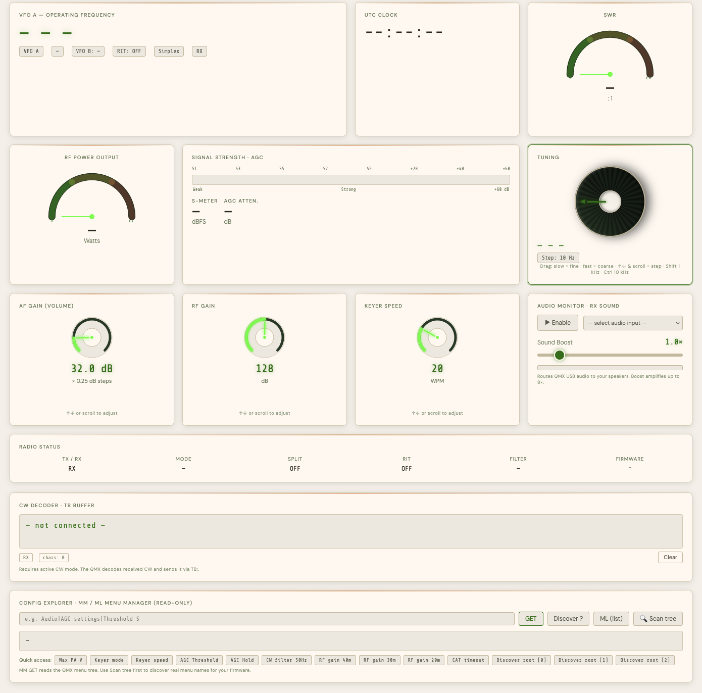
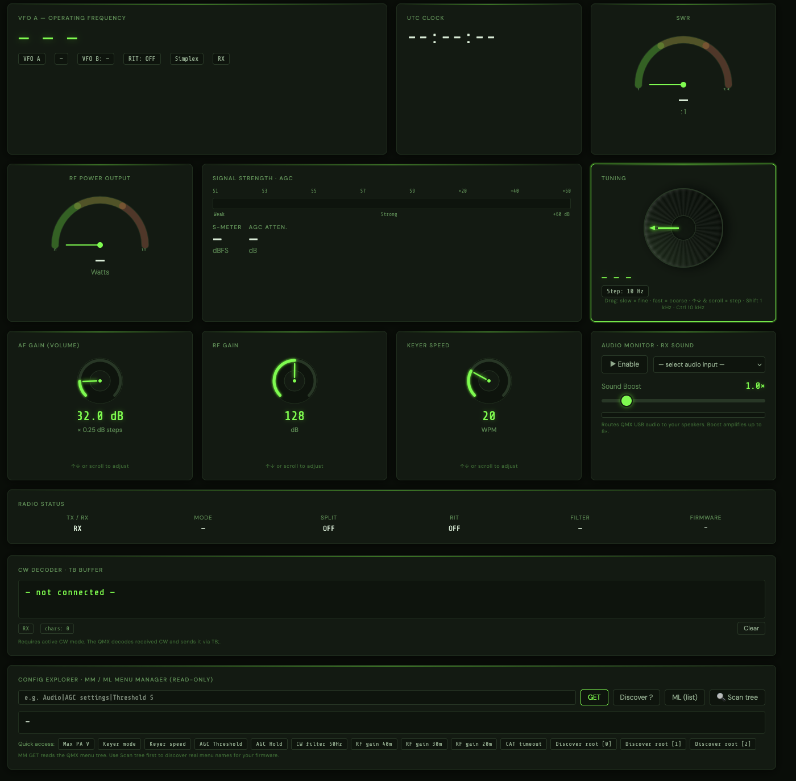

# QMX Health Dashboard Plus

> A browser-based live monitoring and control panel for the **QRP Labs QMX** (and QDX) transceiver,
> connecting directly to the radio via the **Web Serial API** — no drivers, no software to install.

This is a fork of the original [QMX Health Dashboard](https://github.com/Sparks72/QMX-Dashboard) by **Paul Harrison · G4ADF / DJ0CU**, extended with additional monitoring and diagnostic features.

[](https://ja-bertolin.github.io/QMX-Dashboard_plus/)
[](LICENSE)
[](https://developer.mozilla.org/en-US/docs/Web/API/Web_Serial_API)
[](https://github.com/Sparks72/QMX-Dashboard)

---

## ✨ Features

### Inherited from the original dashboard

| Panel | What it shows / does |
|---|---|
| **VFO Frequency** | Live operating frequency with band highlighting |
| **Band buttons** | One-click QSY to CW spots on 160 m – 10 m |
| **Tuning knob** | Drag to tune; velocity-sensitive (slow = 1 Hz fine, fast = kHz coarse); scroll or ↑↓ keys step by the selected increment |
| **Mode chip** | Click to cycle CW → FSK → CW-R → FSK-R |
| **VFO A / B** | Click to swap the active VFO; B frequency shown live |
| **RIT** | Click to toggle; offset displayed when on |
| **Split** | Click to toggle split/simplex |
| **TX key** | Click to key / unkey the transmitter |
| **SWR gauge** | Semicircular analogue gauge + 60-point sparkline |
| **RF Power gauge** | Semicircular analogue gauge + 60-point sparkline (real watts via `PC;`) |
| **S-meter / AGC** | Bar graph S-meter with dBFS and AGC attenuation readout |
| **AF Gain** | Interactive rotary knob with drag, scroll, and keyboard control |
| **RF Gain** | Interactive rotary knob with drag, scroll, and keyboard control |
| **Keyer Speed** | Interactive rotary knob (5 – 60 WPM) |
| **Audio Monitor** | Routes QMX USB audio to speakers via Web Audio API; software boost up to 8×; VU meter |
| **UTC Clock** | Synced from the QMX firmware via `TM;`; falls back to system UTC |
| **Radio Status** | TX/RX, Mode, Split, RIT, Filter BW, Firmware version |
| **Dark / Light theme** | Toggle at any time |
| **Poll rate** | Selectable 500 ms / 1 s / 2 s / 5 s |

### Added in this fork (Plus features)

| Feature | Details |
|---|---|
| **AF Gain in real dB** | Converts the raw CAT value (0–799) to dB: `raw × 0.25 dB`. Knob range corrected to 0–799 |
| **SWR gauge min = 1.0** | Gauge now starts at 1.0:1 (physical minimum), not 0 |
| **Filter width in Hz** | Status bar shows actual filter BW from `FW;` (`3200 Hz` Digi / `300 Hz` CW) |
| **NaN guards on all polls** | Corrupted or out-of-sequence CAT responses are silently discarded, never shown |
| **Per-command response matching** | `rxExpect` ensures each CAT command only accepts its own response prefix, preventing cross-contamination between poll frames |
| **rxBuf overflow protection** | Serial receive buffer is capped at 1 kB and trimmed to prevent degradation in long sessions |
| **Active audio device banner** | A green banner appears below the selector showing the name of the active input device when the audio monitor is running |
| **CW Decoder panel** | Reads the QMX internal CW decoder buffer via `TB;` each poll cycle and displays decoded text in a scrollable output. Shows RX/TX status and character count. Active in CW mode only |
| **Config Explorer panel** | Read-only access to the QMX configuration menu tree via `MM` / `ML` CAT commands. GET, Discover, ML list, and **Scan tree** (auto-discovers all root menu names). 13 preset shortcuts for common parameters |

---

## 🚀 Live Demo

**[https://ja-bertolin.github.io/QMX-Dashboard_plus/](https://ja-bertolin.github.io/QMX-Dashboard_plus/)**

> **Requirements:**
> - Google Chrome or Microsoft Edge (desktop) — Firefox does not support Web Serial API
> - QMX connected via USB-C at 115 200 baud (default)
> - HTTPS (GitHub Pages satisfies this automatically)

---

## 📸 Screenshots

| Dark theme | Light theme |
|---|---|
|  |  |

---

## 🔌 Connecting

1. Open the [Live Demo](https://ja-bertolin.github.io/QMX-Dashboard_plus/) in Chrome or Edge.
2. Plug your QMX into a USB port (USB-C).
3. Click **Connect Radio** — the browser serial port picker appears.
4. Select the QMX port (`/dev/cu.usbserial-*` on macOS, `COMx` on Windows) and click **Connect**.
5. All panels update live at the selected poll rate.

---

## 🛠 Running Locally

Single self-contained HTML file — no build step required:

```bash
git clone https://github.com/ja-Bertolin/QMX-Dashboard_plus.git
cd QMX-Dashboard_plus
# Open index.html in Chrome or Edge
# file:// works for Web Serial — no server needed
```

---

## 📡 CAT Commands Used

| Command | Purpose |
|---|---|
| `IF;` | Frequency, mode, RIT, TX status, Split — all in one frame |
| `FA;` / `FB;` | VFO A and VFO B frequencies |
| `SM;` | S-meter (dBFS) |
| `SA;` | AGC attenuation (dB) |
| `SW;` | SWR (hundredths, e.g. `SW121` = 1.21:1) |
| `PC;` | RF power output (tenths of a watt, e.g. `PC45` = 4.5 W) |
| `AG0;` | AF gain (raw steps × 0.25 = dB) |
| `RG;` | RF gain (dB) |
| `KS;` | Keyer speed (WPM) |
| `FW;` | Filter bandwidth (3200 Hz Digi / 300 Hz CW) |
| `TM;` | QMX UTC real-time clock |
| `VN;` | Firmware version |
| `TB;` | CW decoder text buffer (Plus) |
| `MM` / `ML` | Menu manager — read any configuration parameter (Plus) |

Set commands (`FA`, `FB`, `MD`, `FR`, `RT`, `SP`, `TX`, `RX`, `AG0`, `RG`, `KS`) are sent write-only via a separate fire-and-forget writer path that never contends with the read poll.

---

## ⚙️ Architecture Notes

- **Single HTML file** — CSS custom properties for theming, vanilla JS, no framework or bundler.
- **Web Serial API** — 115 200 baud, 8N1, no flow control.
- **Poll / write separation** — CAT reads use a response-resolving reader loop; CAT writes use a fire-and-forget writer (`sendSetCAT`) that never contends with the read path.
- **Per-command response matching** — `rxExpect` is set by each `sendCAT` call so the reader only accepts the correct response prefix, preventing spurious frames from being delivered to the wrong handler.
- **Tune lock** — during a drag or for 700 ms after a keyboard/wheel tune, the poll read-back is held off so fine (1 Hz) increments are not overwritten by the rig's 10 Hz CAT resolution.
- **Velocity-sensitive tuning** — angular speed on the drag knob maps through a power curve (exp 2.6) to Hz/degree, giving a wide fine-tuning zone and coarse travel on fast spins.
- **Config Explorer** — uses `MM<path>;` (GET), `MM<path>?;` (Discover) and `ML<n>;` (list values) from the QMX CAT manual (firmware 1.03). Read-only — no EEPROM writes.

---

## 📋 Changelog

### v27 (Plus fork baseline — September 2026)
- Merged all features from original v26 (velocity tuning, tune lock, step chip, VFO A/B, clickable chips)
- Added CW Decoder panel (`TB;`)
- Added Config Explorer panel (`MM` / `ML`, read-only)
- AF Gain corrected to dB display (raw × 0.25), knob range 0–799
- SWR gauge minimum corrected to 1.0
- Filter width shown in status bar (`FW;`)
- `isNaN` guards on all polling `parseInt` calls
- Per-command `rxExpect` response matching
- `rxBuf` overflow protection (1 kB cap)
- Active audio device banner
- All UI strings in English

---

## 🪪 Credits

- **Original dashboard**: [Paul Harrison · G4ADF / DJ0CU](https://github.com/Sparks72/QMX-Dashboard) — Fehmarn Island, Germany
- **Plus fork**: Juan · EA5XQ — developed with AI assistance (Claude, Anthropic)
- **Radio**: QRP Labs QMX — [qrp-labs.com](https://www.qrp-labs.com)
- **CAT reference**: QMX CAT Programming Manual, firmware 1.03 — Hans Summers, QRP Labs

---

## 🪪 Licence

MIT — see [LICENSE](LICENSE).  
Original work © 2026 Paul Harrison (G4ADF / DJ0CU). Fork additions © 2026 Juan · EA5XQ.
